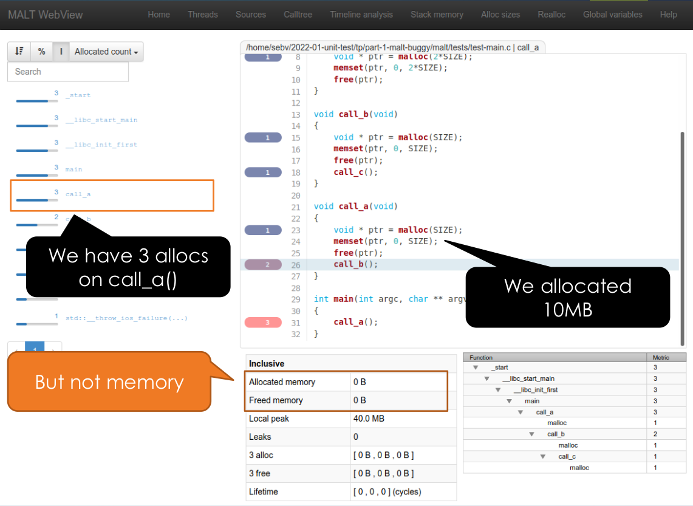

Unit test practical session
===========================

Clone the sources
-----------------

```sh
git clone /home/admin/sebv/unit-test-tp.git
cd unit-test-tp
```

Correction
----------

You can find the correction in the `correction` branch.

What will be done
-----------------

This practical sessoin proceed in three steps:

 - See how fast can unit tests be to find and fix a bug in an unknown software compared to integration test or no tests (example on MALT).
 - First unit tests on a particle class in python or C++
 - First usage of mocking on a cache implementation in python or C++

Debugging MALT
--------------

Go into the `part-1-malt-bug/malt` directory and build malt.

```sh
cd part-1-malt-bug/malt
mkdir build
cd build
../configure --enable-debug --prefix=$HOME/usr
make
make install
# add the local binary path to $PATH
export PATH=$PATH:${HOME}/usr/bin
```

If you work on a remote server, you will need to forward
a port to get the malt webview rendered in your local browser.
If the server you are running by multiple users doing this
practical session randomly choose a port in place of the
8080.

```sh
# we forward the port to get access to the webview from
# our browser
ssh -i keys/{username}.key {username}@{server} -L8080:localhost:8080
```

If you want to play with it:

```sh
# profile the application
malt ./tests/test-main
# launch the webview
# The first time it will ask the create a user/password to secure the GUI
malt-webview -i malt-test-main-{PID}.json -p 8080
```

Now you can open your local browser on http://localhost:8080:
 - Go in the source view
 - Click on function `call_a` on the left
 - Look on the page bottom table
 - It says the allocated memory is 0



You can launch an integation test:

```sh
ctest
```

Move to verbose mode to get its output;

```sh
ctest -V
```

Try to debug like this. Not so easy if you don't know the code in advance (even like this). 
Take a few minutes to try anyway.

After a few minutes, lets enable the unit tests:

```sh
../configure --enable-debug --enable-tests
make
make test
```

Find the faulty unit test;

You can run only this one with:

```sh
ctest -R {TEST_NAME} -V
```

**TODO**: Find the source location of the test and go to it.
**TODO**: Look on what is used and go in the implementation source (you might need to use grep to find the function).
**TODO**: Look on the code and find the issue, look on comments.

Run again the tests to check the solution.
Is it not easier with unit tests ?

First unit test in python
-------------------------

We will make out first unit test, in python.

TODO: Go in `part-2-simple-ut-particle/python`.

We will test a particle in a 1D space which can move and collide.

**TODO**: Look on `test_basic.py` and run the test with:

```sh
# pytest, on debian :
pytest-3
```

**REMARK**: the tests should be named `test_*.py`.

Now to into `test_particle.py`, we will test the particle.

TODO: test the constructor and the `move()` function.

```python
class Particle:
	def __init__(x, vx)
	def move(dt)
	def get_x()
	def get_vz()
```

You can to:
 - create a particle
 - test the default properties
 - move it
 - test again the properties

There is also the physics implementation in `physics.py` which provide:

```python
def collide(particle1: Particle, particle2: Particle, dt) -> bool:
def elastic_collision(particle1: Particle, particle2: Particle, dt) -> bool:
def get_collision_time(particle1: Particle, particle2: Particle):
```

Now test the `physics::collide()` and `physics::elastic_collision()` in `test-physics.cpp`.

Particle in C++
---------------

If you know C++ you can transpose the tests in C++ in the `part-2-simple-ut-particle/cpp` directory. We ill use Google Test to
write our tests.

To build:

```sh
mkdir build
cd build
cmake ..
make
make test
```

Look in `test-basic.cpp` for an example and implement the particle tests.

Apply mocking by testing a cache
--------------------------------

If you go in `part-3-cache-mock/python` you will find a cache to be tested.

There is two components:
 - The cache to keep the data in memory.
 - A storage backend generic class to say how to write the data to/from its final destination.

```python
class StorageBackend:
	def pwrite(self, data: bytearray, offset) -> int:
	def pread(self, offset, size) -> bytearray:

class Cache:
	def __init__(backend: StorageBackend):
	def pwrite(self, data, offset):
	def pread(self, offset, size)
	def flush():
```

We will mock the storage backend to not have the real final implementation
which can possiblty depend from an external comple database or
any other storages.

You can first look on `test_basic_mock.py` to see how we mock a function.

We will make two king of mocking:
 - A first one by hand (without any framework)
 - A second one using the python default mocking framework.

First implement a mocked version of the storage backend. You should
hardcode the responses to return for the pread and pwrite calls.
`pwrite()` return the size which has been written, choose 5 if you will write "Hello". `pread()` will return a fixed bytearray.

